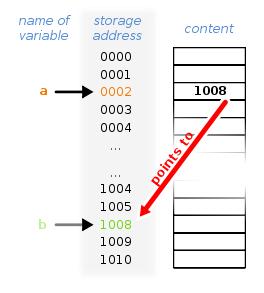

I promise you that you will understand pointers.  They are actually not too bad to understand conceptually. Where its tricky for beginning programmers is how to use them and remembering all the nuances surrounding them.  Let's start with what we know and make the stretch to pointers.  

We will begin with ints.  So far we've dealt with variables, like <code>int someNum = 46;</code>.  What this means is that on the physical computer, in memory, at the address of someNum, we have the integer 46.  Pointer variables look similar and are assigned as <code> int * somePointer;</code>. Pointer variables deviate from regular variables in that they hold an address to somewhere else in memory that is holding an integer, not an integer themselves.  So when you look at the contents of a pointer, you would find an address.  That address the pointer holds is where on the computer the integer resides.  In the photo below, variable a holds the address to variable b, where our integer would actually live on the computer.

 

You're probably thinking...Why do this?  That is a fair question.  Because when passing data between functions, you can either do so by value (<code>int someNum;</code>) or address (<code>int * somePointer;</code>). The difference is that when you pass by value, the computer makes a copy of the data you are passing and any work done on that copy doesn't transfer to the original variable.  It also doubles the amount of space needed for that variable in the program since it needs to make a copy.  Simply put, this makes for inefficient code and that matters on a large scale.

Pointer variables can only point to data that has the same type.  From our examples above, we could assign <code>someNum</code> to the pointer <code>somePointer</code> like so: <code>somePointer = &someNum;</code>.  The <code>&someNum</code> means address of someNum.  So now our <code>somePointer</code> holds the address of <code>someNum</code>, which holds our value of 46.  If you wanted to read or change 46, from somePointer, you would need to use a special symbol <code> *somePointer </code> to "de-reference" it. So to print out somePointer (and simultaneously someNum), you type <code> cout << *somePointer << endl;</code> and to change the value that somePointer points to (the value in someNum), you do so as <code>*somePointer = 88;</code> in both instances using the "*" to de-reference the address the pointer points to.

If that all takes a while to sink in it's ok.  It took me a while as it does everyone when the concept is first laid in front of them.  The best way to learn pointers is to program using them and push through the frustrations that may pop up. You will get there!

Vectors are fantastic!  Think of them as arrays but much more modern, with their own functions that allow you to add, remove, and adjust them with simple pre-built functions.  To use them, be sure to import the vector library using <b>#include &lt;vector&gt;</b>  .  From there you can create a vector of any datatype, including your own custom defined class objects.  You would declare a vector like this:  <code>std::vector&lt;int&gt; someInts;</code> or <code>std::vector&lt;BankAcct&gt; accounts;</code> for a vector of <code>int</code>'s or our customer <code>BankAcct</code> class.  To add values to the end, simply call <code>someInts.push_back(42);</code> and to remove that same number, call <code>someInts.pop_back();</code>  There are so many more functions that you can use with vectors. <a href="http://www.cplusplus.com/reference/vector/vector/"> For a complete list of available vector functions, check out this reference.</a>

 <a href="../../projectCode/l9.zip" download>Download all code files</a>

  <iframe class="embed-responsive-item" src="https://www.youtube.com/embed/ZtEK3hUguww" frameborder="0" allow="encrypted-media" allowfullscreen></iframe>

  <iframe class="embed-responsive-item" src="https://www.youtube.com/embed/JEgAkxICluQ" frameborder="0" allow="encrypted-media" allowfullscreen></iframe>

